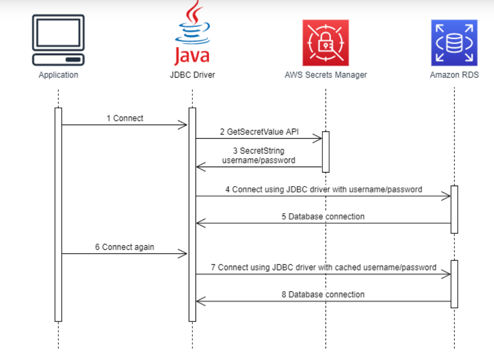

### Springboot AWS Secret Manager for RDS

1. Go AWS Management Console and open the Amazon Secrets Manager console here then make sure you choose the same AWS Region as that of the MySQL database

2. In the navigation pane, choose Secrets then Store a new secret on the top-right of the Secrets table to open the below page:

AWS Secrets Manager console : store a new secret

3. Secret type : Credentials for Amazon RDS database

4. Username : whatever

5. Password : whatever

For steps 4 and 5, use the same username and password as the database.

6. Database : choose product_management DB instance and click Next

7. Secret name : rds-credential/dev, leave default options and click Next

8. Leave all the default options again and click Next to go to the Review page.

9. Click Store

10. Optional: AWS Access Key and Secret Key can also be accessed from Secrets Manager using Other General Type

